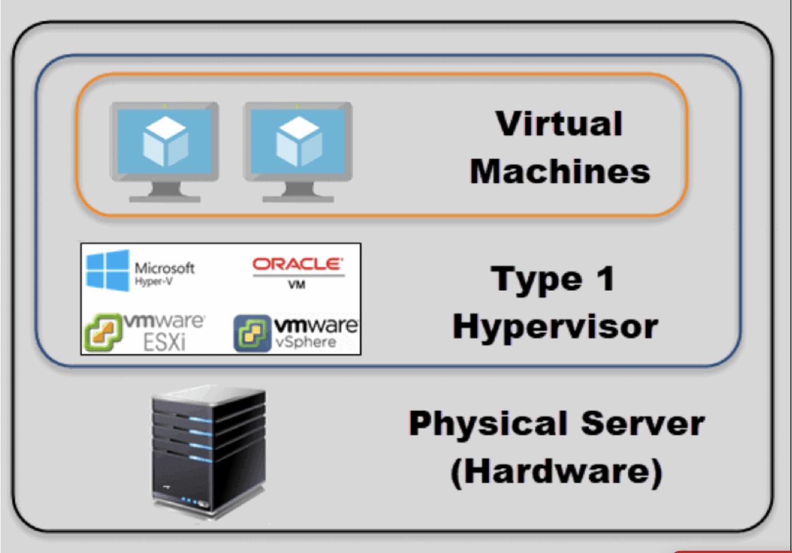
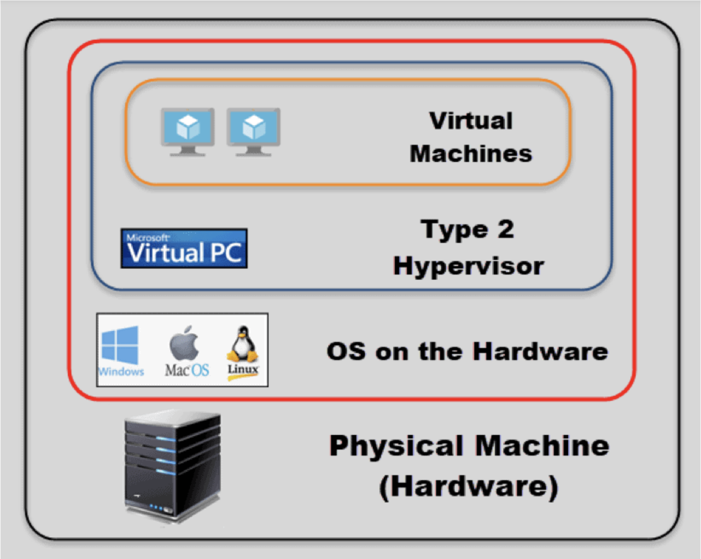

# **Hypervisor**

Hypervisor 是個實現虛擬化的**軟體**。

Hypervisor 創造了一個可以分離像是 CPU, RAM 等等硬體資源的虛擬層。

安裝 Hypervisor 的電腦我們稱為 host machine ，相對的透過Hypervisor跑在 host machine 上的電腦即為 guest machine。

Hypervisor模擬硬體資源給 guest machine 使用，並且使得 VM 分不清使用的是虛擬資源還是實體資源。

有兩種Hypervisor：

* Type 1, also called bare metal or native
* Type 2, also known as hosted hypervisors

#### Type 1

是直接將Hypervisor安裝在電腦上的，也就是硬體和Hypervisor之間並沒有再隔一層OS，也可以說Hypervisor就是OS本身。

#### Type2

Hypervisor會跑在既有的OS之中當作一個process被看待。

Reference : https://phoenixnap.com/kb/what-is-hypervisor-type-1-2

